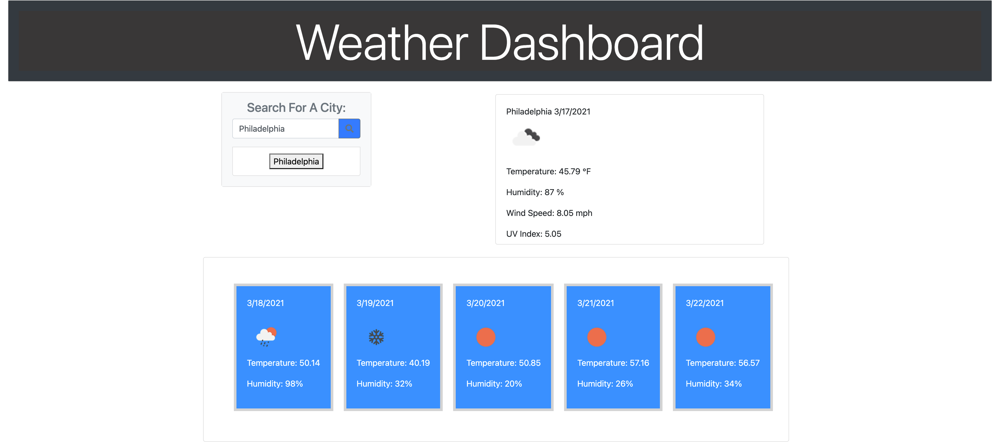

# Weather-Dashboard

## Approach 

To tackle this task of building a weather dashboard I had to implement many different languages and frameworks that we have learned over the past 3 weeks. Included in this application is the languages HTML, CSS, and JavaScript. Of those languages we have many frameworks in play for styling including bootstrap, font awesome and google fonts and using jQuery on the JavaScript side. I first laid out my index.HTML using bootstrap cards so that my content would be responsive and polished once it was displayed on the page. Once I had an idea of what my layout would be then I could start the process of creating, adding text content and appending those sections in my JS file. In the JS file I had to fetch data using an API from <a href="https://openweathermap.org/">openweathermap.org</a>. This API call allowed me to pull data from whatever location the user enetered in the search bar. Now that the data was retrieved, it could dynamically be applied to the web page and displayed to the user. The data displayed includes the current city, temperature, humidity, wind speed, and UV index. Along with the current weather there was also an API call for the 5 day forecast. I thought it best to display the 5 day forecast based off the time at 12pm each day so that was the approach I took. 

## Installation

To install this repo on your local drive you would have to clone the ssh key from my repo. Head into your local drive of choice in terminal or bash and do a git clone. Once you have done a git clone you are free to start working on this project. If you want to push your changes to my repo then you would have to head into terminal/bash and do a git add . Then a git commit -m explaning the changes made, and finally a git push to push the files onto the repo. 

## Finished project
My page is live on github!

https://mattrward1030.github.io/Weather-Dashboard/

## Features
<ul>
<li>A user can see the weather for multiple cities so they can plan a trip accordingly.</li>
<li>The user is presented with a search bar so they can input the name of a city.</li>
<li>When they search for a city they are presented with current and future conditons for that city.</li>
<li>They are presented with the city name, the date, an icon representation of the weather conditions, the temperature, the humidity, the wind speed and the UV index.</li>
<li>The user is presented with a 5 day forecast that displays the date, a weather icon, the temperature and the humidity for each of the following 5 days.</li>
<li>This web page is comprised of three main files, a HTML, CSS, and JavaScript file.</li>
<li>The HTML houses all of the content that is then being styled with Bootstrap using column and row layouts. The classes and id's are then further styled in CSS.</li>
<li>The JavaScript file is built along with jQuery. It includes API calls and uses the fetch method to then take and parse that data to be able to grab certain values that are then displayed to the user.</li>
</ul>

## Tests
N/A

## Credits
<a href="https://openweathermap.org/">openweathermap.org</a>.

## Contributing

Pull requests are welcome and encouraged. Hit me up on my github <a href="https://github.com/mattrward1030">mattrward1030</a>

## Badges
 

## License

MIT License

Copyright (c) [2021] [Matthew Ward]

Permission is hereby granted, free of charge, to any person obtaining a copy
of this software and associated documentation files (the "Software"), to deal
in the Software without restriction, including without limitation the rights
to use, copy, modify, merge, publish, distribute, sublicense, and/or sell
copies of the Software, and to permit persons to whom the Software is
furnished to do so, subject to the following conditions:

The above copyright notice and this permission notice shall be included in all
copies or substantial portions of the Software.

THE SOFTWARE IS PROVIDED "AS IS", WITHOUT WARRANTY OF ANY KIND, EXPRESS OR
IMPLIED, INCLUDING BUT NOT LIMITED TO THE WARRANTIES OF MERCHANTABILITY,
FITNESS FOR A PARTICULAR PURPOSE AND NONINFRINGEMENT. IN NO EVENT SHALL THE
AUTHORS OR COPYRIGHT HOLDERS BE LIABLE FOR ANY CLAIM, DAMAGES OR OTHER
LIABILITY, WHETHER IN AN ACTION OF CONTRACT, TORT OR OTHERWISE, ARISING FROM,
OUT OF OR IN CONNECTION WITH THE SOFTWARE OR THE USE OR OTHER DEALINGS IN THE
SOFTWARE.
